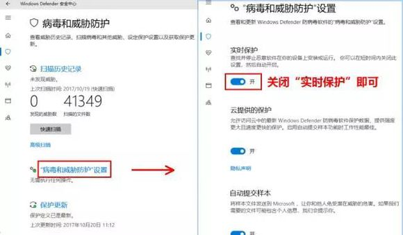
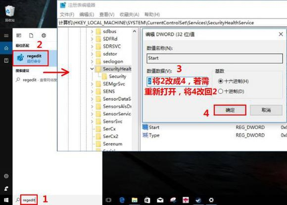
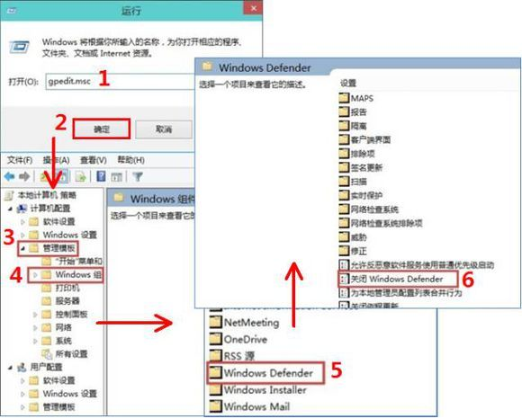

# 关闭实时保护

【WIN+I】组合键选择【更新和安全】,进入【Windows Defender】并【打开Windows Defender安全中心】，点击【病毒和威胁保护】进入【“病毒和威胁防护”设置】即可关闭“实时保护”。

彻底关闭Windows Defender

在Cortana搜索栏中输入“regedit”回车，进入注册表编辑器。定位到HKEY_LOCAL_MACHINE\SYSTEM\CurrentControlSet\Services\SecurityHealthService在右侧找到“start”并双击将“数值数据”由2更改为4即可。

若需重新打开，重复以上步骤并将4改回2即可。

注意：修改注册表有风险，需谨慎

以上方法适用于WIN10各版本，WIN10专业版除修改注册表外可以通过组策略彻底关闭Windows Defender

专业版用户彻底关闭Windows Defender

通过“WIN+R”组合键输入“gpedit.ms”回车进入组策略，依次点击“管理模板”“Windows组件”，找到并双击“Windows Defender”，双击关闭“Windows Defender”，点击“已启用”“确定”即可。

