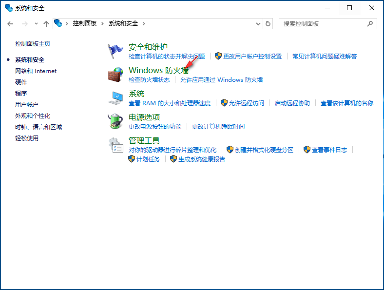

# windows server 允许ping服务器

​    【简介】Windows 7、10、Server 等系统默认安装了软件防火墙，为了安全考虑不回应Ping包信息，但我们习惯用Ping包来测试电脑是否连通，这就需要做点改动。

------

 **老鸟 - 关闭防火墙**

​    很多老鸟都知道，因为防火墙阻止了回应Ping包，最简单粗暴的方法就是关闭防火墙。

​    ① 点击左下角Windows窗口图标，弹出菜单里点击【控制面板】。

​    ② 在控制面板窗口点击【系统与安全】。

​    ③ 在系统和安全窗口点击【Windows 防火墙】。

​    ④ 在Windows 防火墙窗口点击【启用或关闭 Windows 防火墙】。

​    ⑤ 将专用网络和公用网络的防火墙都关闭。

​    ⑥ Ping服务器的IP地址，在网络没有问题的情况下可以看到Ping包信息。

**正确做法
** 

​    虽然关闭防火墙可以Ping包测试服务器是否连通，但这样并不安全，我们可以在不关闭防火墙的情况下，也允许服务器Ping包测试。

​    ① 在Windows 防火墙界面可以看到防火墙是启用的，点击【高级设置】。

​    ② 在高级安全Windows防火墙界面，点击【入站规则】。

​    ④ 默认显示常规内容，选择【已启用】打钩，点击【确定】就可以了。

