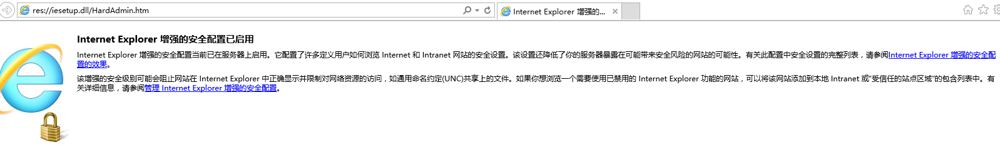
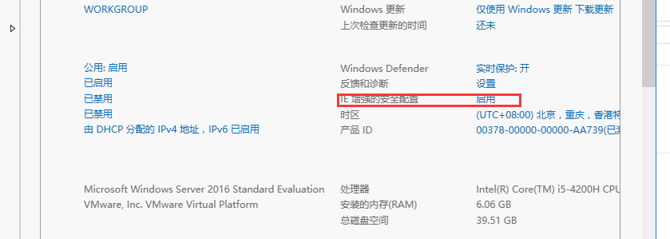
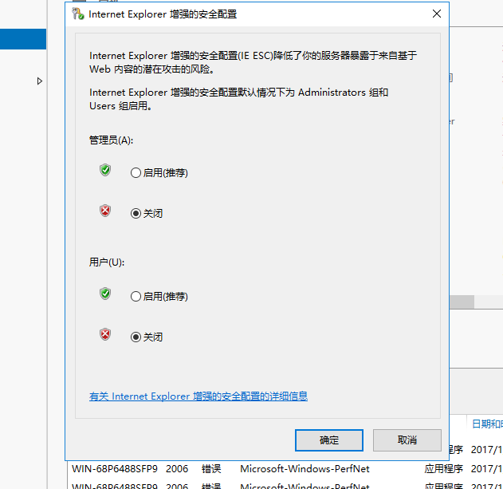
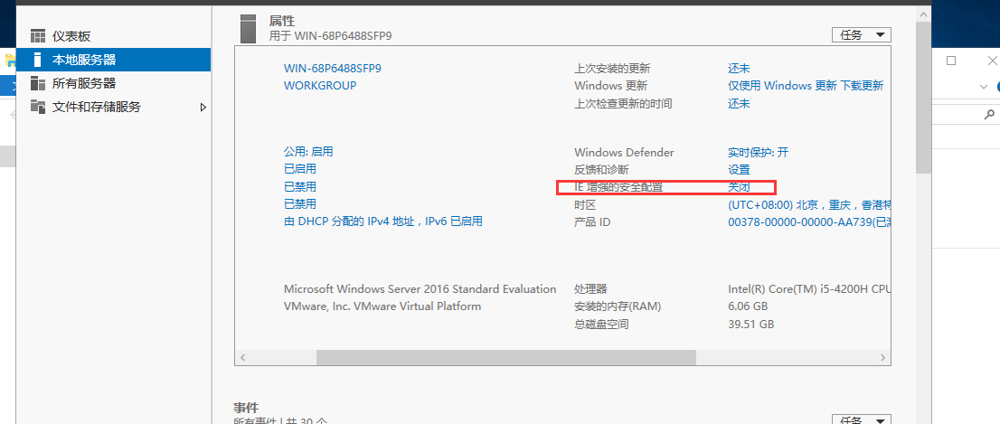
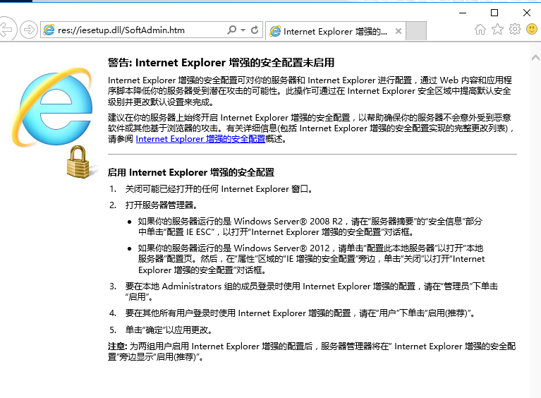
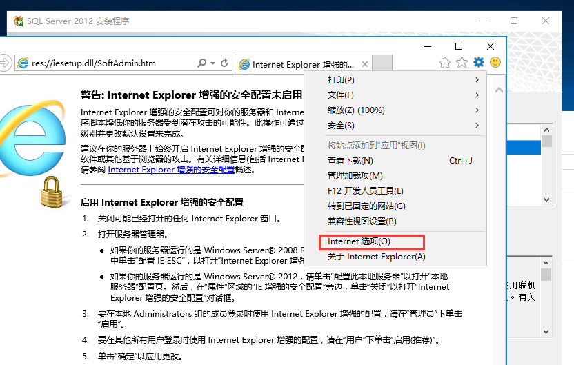
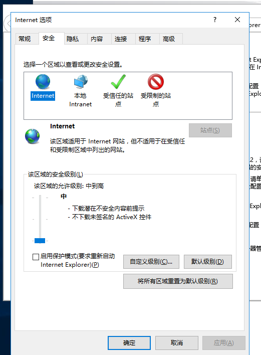
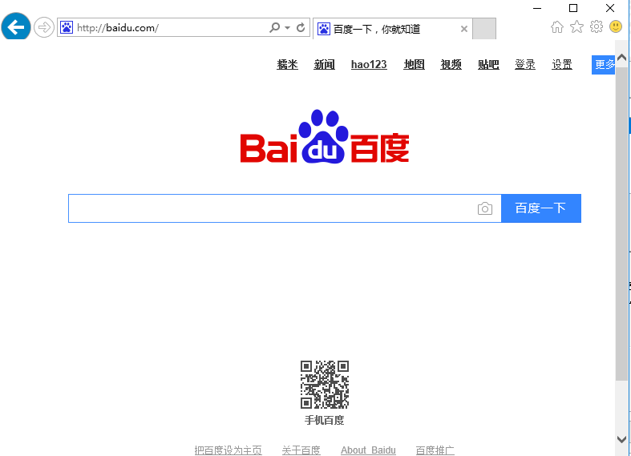

# 关闭IE烦人的安全提醒

[原文](https://www.cxyzjd.com/article/h106140873/77525672)

一般我们安装完服务器后，开启 Internet Explorer 会发现无法上网或者上网内容被屏蔽掉了

### 问题的发生原因

在 Windows Server 2016 通常扮演重要的服务器角色，不应该用来做上网等工作，可能会增强被攻击的疑虑。如果您想要关闭【Internet Explorer 增强的安全配置】，然后进行调整安全性等级的动作，可从【服务器管理员】中进行设置。

 

### 问题的解决方法

1. 开启【服务器管理员】。

2. 在左边窗格切换至【本机服务器】，在右边【内容】中，选择【IE 增强的安全配置】。

 

 

 

 

3. 您可以针对【系统管理员】或【使用者】启用或关闭【Internet Explorer 增强的安全配置】，完成设置后按【确定】。

 

 

 

4. 当您设置关闭【Internet Explorer 增强的安全配置】后，可看到该选项呈现【关闭】状态。

5. 开启 Internet Explorer 时，也会显示【未启用 Internet Explorer 增强的安全配置】警告信息。

 

 

6. 安全性等级则降级至【中高】，您可以自行设置您要的安全性等级。

 

7.打开百度试试

