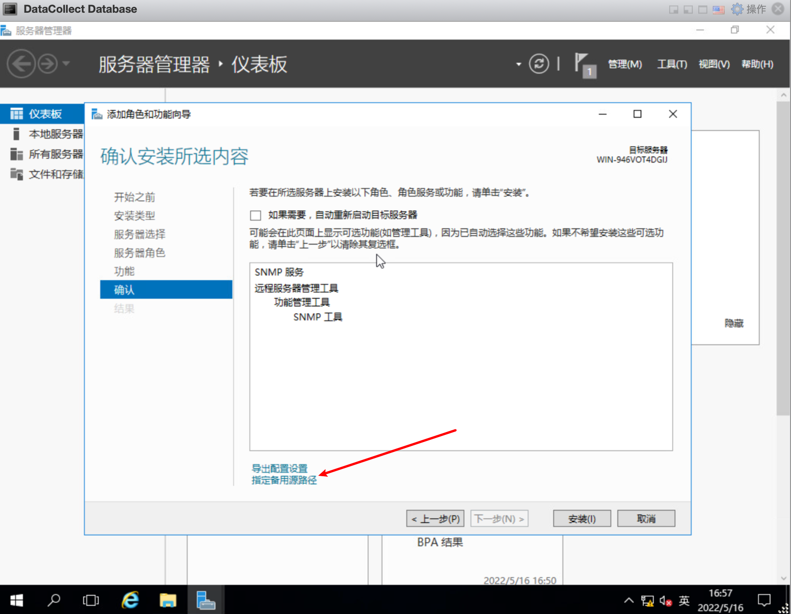

# 安装.net 3.5

参考链接：

[How to install the .NET Framework 3.5 on Windows Server 2016 and later](https://blogs.sap.com/2020/06/25/how-to-install-the-.net-framework-3.5-on-windows-server-2016-and-later/)

[Install .NET Framework 3.5 on Windows Server 2016](https://spgeeks.devoworx.com/how-to-install-net-framework-3-5-on-windows-2012/#how-to-install-net-framework-35-on-windows-server-2016-offline)

安装分离线安装和在线安装

## 离线安装

1. 挂载windows server 镜像（前提）
2. 打开windows server 管理工具
3. 添加角色和功能

4. 下一步到安装类型选择
5. 安装类型选择如图

6.选择服务器

7. 下一步

8. 勾选 .net frame work 3.5

9. 选择镜像

10.点击安装，等待安装完成