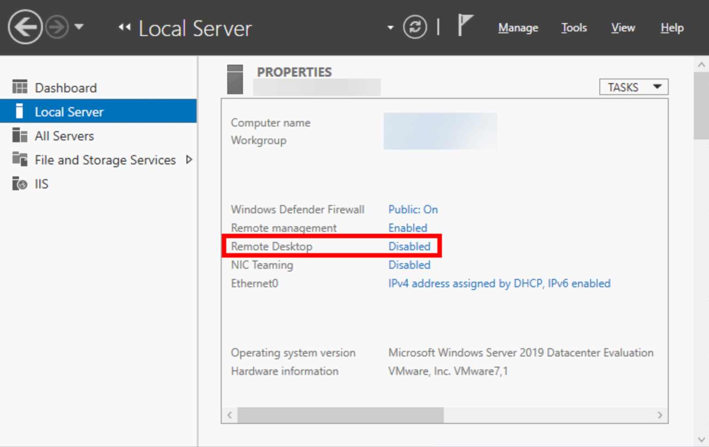
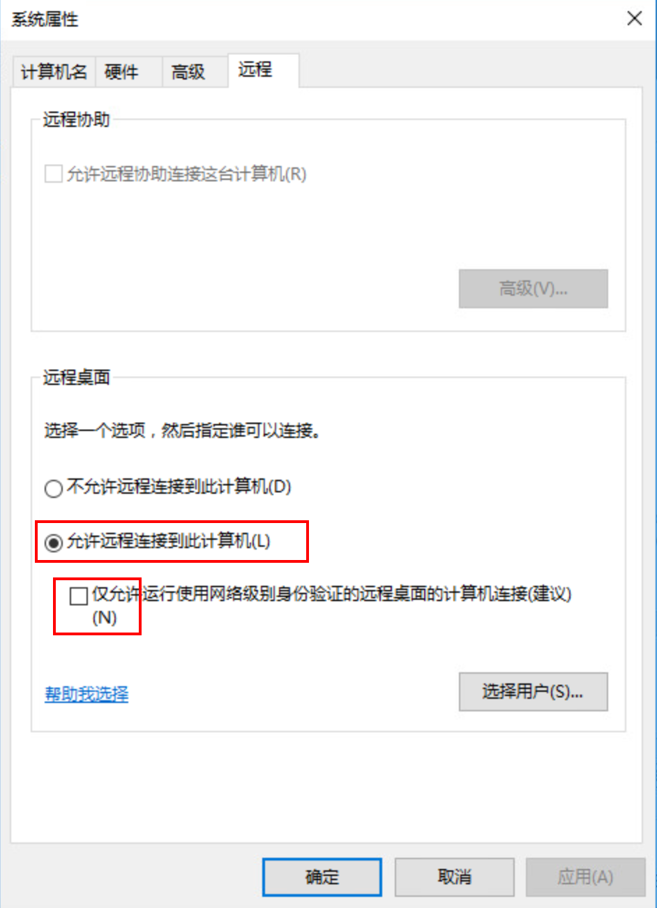

# 打开远程桌面连接

[打开远程桌面连接](https://cn.desmoineshvaccompany.com/how-enable-remote-desktop-windows-server-2019)

1. 首先，您需要以本地管理员身份登录到服务器。
2. 导航到开始菜单，然后搜索“ **服务器管理器”** 。 从搜索结果列表中单击**服务器管理器**以将其打开。
3. 服务器管理器 窗口打开后，导航至左侧，然后单击**本地服务器** 。 默认情况下，远程桌面是禁用的。 单击“ **远程桌面”**前面的“ **禁用”**按钮。

4. 现在将在屏幕上打开“属性设置”窗口。 单击“ **允许远程连接到此计算机”** 。

5. 您将看到远程桌面防火墙例外警告，然后单击“ **选择用户”**按钮以添加允许的用户。
6. 现在添加用户名，然后单击“ **检查名称”**按钮。 最后，单击“ **确定”**保存更改。
7. 您可能需要刷新视图，才能将“远程桌面”的状态更改为“已**启用”** 。