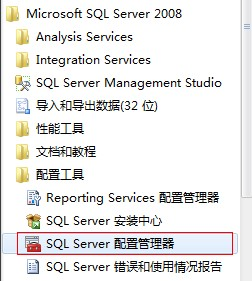
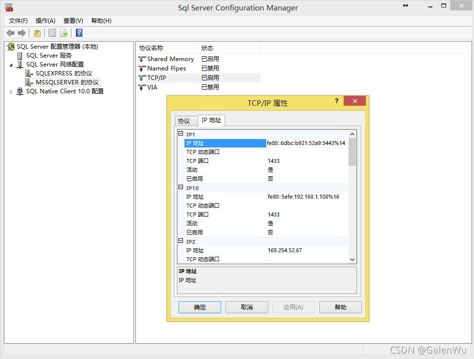
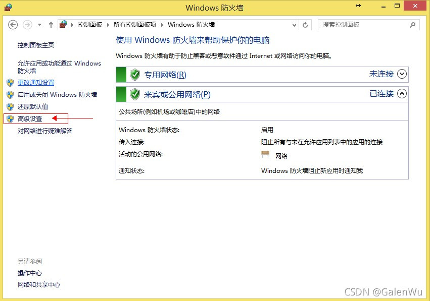
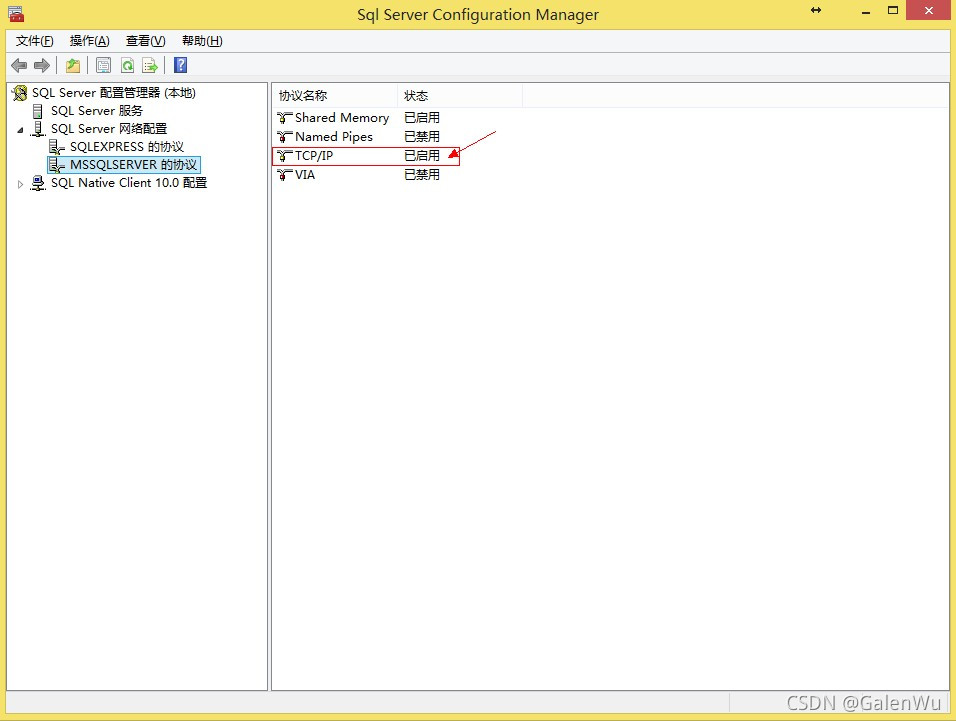
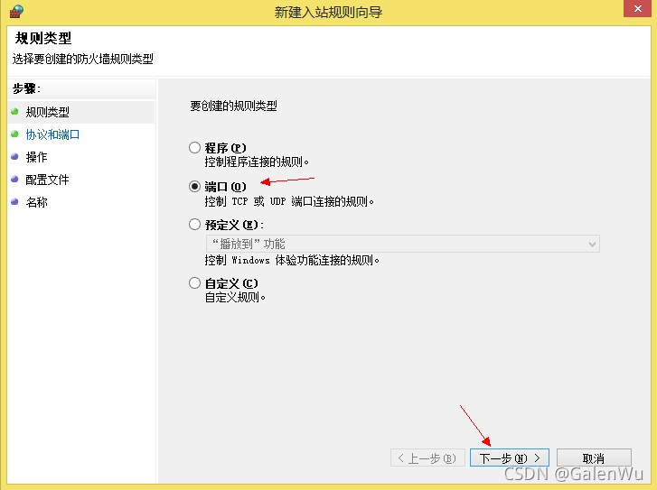
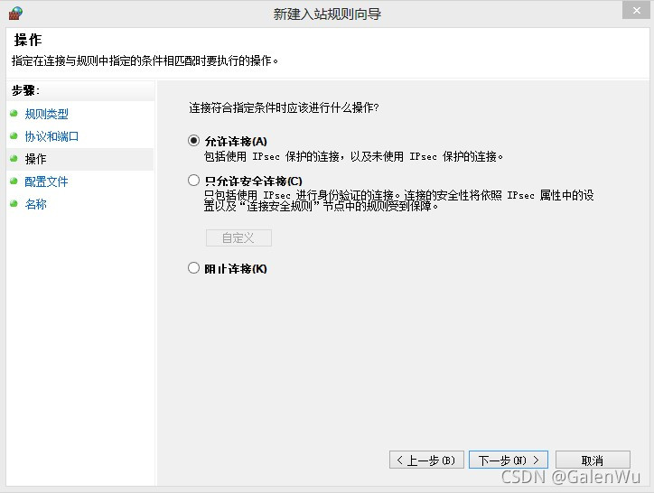
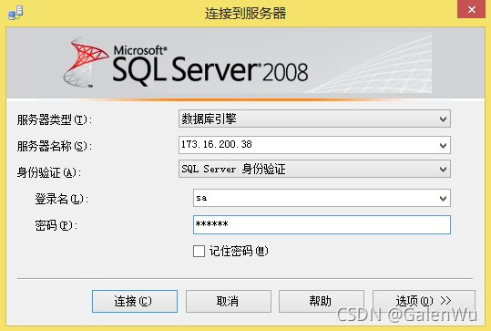

# windows server 防火墙开放sqlserver端口

​                                            

## **（一）首先是要检查SQLServer数据库服务器中是否允许远程链接。其具体操作为：**

（1）打开数据库，用本地帐户登录，右击第一个选项，选择属性：
 
 （2）在打开的属性窗口，在其右边点击“连接”，然后再左侧勾上“允许[远程连接](https://so.csdn.net/so/search?q=远程连接&spm=1001.2101.3001.7020)到此服务器”：

## **(二)为微软SQL服务器（MSSQLServer）配置相应协议。**

（1）依次选择：开始-〉所有程序-〉Microsoft SQL Server 2008-〉配置工具-〉SQL Server配置管理器，如下图所示：
 
 （2）打开SQL Server配置管理器后，选择SQL Server网络配置下面的MSSQLSERVER，然后看右边里面的TCP/IP是否为“已启用”，如下图所示：
 

## **（三）检查SQL服务器防火墙设置 （快捷步骤-直接关闭防火墙（不安全））**

（1）在进行完上两步操作后，用户需要做的是对SQL服务器防火墙进行重新配置。在进行这一步操作时，首先找到SQL服务器上那个端口支持TCP/IP协议。用户可以在SQL服务器防火墙已经处于运行状态下，右击“TCP/IP协议”选择“属性”:
 
 从上图中我们可以看出，这台SQL服务器上支持TCP/IP协议的是1433端口。下一步要做的是在防火墙的配置中允许1433端口支持TCP/IP协议即可。如果服务器上运行的是Windows 7操作系统，其配置步骤为（其他微软操作系统的做法类似），打开“控制面板”选择“Windows防火墙”选项，然后点击高级选项，如下图所示：
 （2）选择“高级设置”后，在右边菜单栏中找出“具有高级安全选项的Windows防火墙”并将其打开。打开后会发现在左边菜单栏中有“入站规则（Inboud Rules）”选项。将该选项打开，并在右边菜单栏中选择“新建规则（New Rule）”选项：
 

（3）打开“新建规则”选项后，利用“新内置绑定规则向导”为1433端口配置“内部绑定协议”配置为适用于TCP/IP协议即可。（前提是，需要完成该步骤以前所述的所有步骤），根据下面的几幅图为1433端口配置适用于1433端口即可：
 

 
 最后点击“完成”即可。测试方法：在局域网内找一台电脑，打开SQLServer数据库，然后输入你的Ip和密码，如果能连接上，就说明已经配置好了，如下图所示：
 
